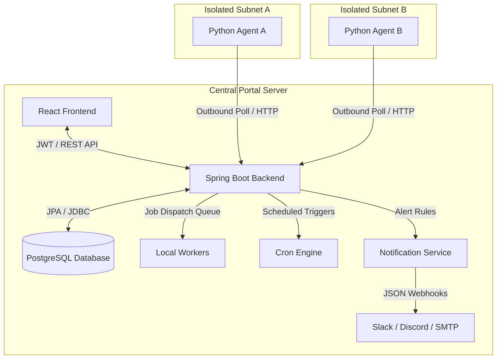

# 🌐 Distributed Network Monitoring & Diagnostic Portal

A production-grade, secure orchestration portal designed to coordinate distributed network diagnostics (Ping, iPerf3) across multiple remote subnets. Built with **Spring Boot 3 (Java 17)**, **React (Vite)**, and **Python-based polling edge clients**, this platform solves the problem of "vantage point bias" in network monitoring by measuring latency and throughput from the edge of your network back to target endpoints.

---

## 🚀 Key Features

* **Distributed Edge Polling Architecture**: Remote agents run as lightweight Python processes within isolated subnets. Instead of exposing subnets via inbound firewall ports, agents securely poll the central controller outbound using UUID-based headers (`X-Agent-Token`).
* **🌐 NOC Subnet Topology Map**: A real-time visual NOC (Network Operations Center) board in the frontend displaying active connections, pulsing controller states, and live CSS packet stream animations representing active polling.
* **🛡️ Command Injection Protection**: Deep parameter sanitization combined with custom Spring JSR-380 validators (`@HostOrIp`) ensuring that user-provided test inputs cannot trigger shell code execution vulnerabilities on local or remote runners.
* **⏰ Dynamic Cron Scheduling**: Set automated execution schedules (e.g., hourly pings or daily throughput checks) per profile using standard Spring Scheduler cron triggers, dynamically controlled via the UI.
* **🚨 Multi-Channel Alerting**: Instant alerting dispatch to **Slack** and **Discord** webhooks if latency or packet loss breaches defined thresholds, with internal console-based SMTP warnings.
* **📊 Historical Trends & Charts**: Pop-over timelines utilizing **Recharts** to display latency (min/avg/max) and packet loss metrics over time, helping administrators spot network degradation trends.
* **🔑 Role-Based Access Controls (RBAC)**: Secure access restricted via JWT stateless authentication. Roles include `ADMIN` (full access), `OPERATOR` (run tests/view results), and `VIEWER` (read-only charts).
* **📝 Security Audit Trails**: All structural or administrative modifications (user role edits, agent token generation, manually triggered runs) are recorded in a permanent audit log database.

---

## 📐 System Architecture



---

## 🛠️ Technology Stack

* **Backend**: Spring Boot 3, Java 17, Spring Security, JWT, JPA/Hibernate, Spring Validation
* **Frontend**: React 18, Vite, Recharts, Custom NOC CSS Animations
* **Database**: PostgreSQL 15
* **Edge Runners**: Python 3.10+, socket, subprocess, requests

---

## ⚙️ Setting Up The Environment

### 1. System Requirements & Dependencies
Before launching, make sure the running machine has the following tools installed:
* **Java 17 JDK** or higher
* **Maven 3.8+**
* **Docker & Docker Compose**
* **Python 3.10+** (with the `requests` library)
* **System Utilities**: `iperf3` and `iputils-ping` must be in your system path if you intend to run local tests.
  ```bash
  sudo apt update && sudo apt install iperf3 iputils-ping -y
  ```

---

## 🚀 Step-by-Step Running Guide

### Step 1: Start PostgreSQL
```bash
docker compose up -d
```

### Step 2: Build & Start Spring Boot Backend
1. Navigate to the backend directory:
   ```bash
   cd backend
   ```
2. Build the JAR package:
   ```bash
   mvn clean install
   ```
3. Run the application:
   ```bash
   mvn spring-boot:run
   ```
   *The server starts on port `8082`.*

### Step 3: Start React Frontend
1. Navigate to the frontend directory:
   ```bash
   cd frontend
   ```
2. Install node dependencies:
   ```bash
   npm install
   ```
3. Run the development server:
   ```bash
   npm run dev
   ```
   *The UI starts on port `5173`. Open your browser to `http://localhost:5173`.*

### Step 4: Connecting a Remote Subnet Agent
1. Log in to the portal as `admin` (default password: `adminpassword`).
2. Go to the **Subnet Agents** page.
3. Register a new agent name (e.g. `Dev-Sandbox`) and copy the generated **Security Token**.
4. In your terminal, launch the Python agent script:
   ```bash
   PORTAL_SERVER_URL="http://localhost:8082" AGENT_TOKEN="<PASTE_YOUR_GENERATED_TOKEN>" python3 python-agent/agent_client.py
   ```
5. Look at the **NOC Subnet Topology Map**—the agent's state will instantly turn **ONLINE** with real-time green signal flows.

---

## 🛡️ Security Audit & Verification Flow

To verify backend-enforced commands, you can inspect the JWT-protected endpoints using curl:

### 1. Authenticate & Obtain Token
```bash
curl -X POST http://localhost:8082/api/v1/auth/login \
  -H "Content-Type: application/json" \
  -d '{"username": "admin", "password": "adminpassword"}'
```

### 2. Dispatch a Test Job (Targeting the Remote Agent)
Once you have the token, issue a test job by referencing the profile ID:
```bash
curl -X POST http://localhost:8082/api/v1/jobs \
  -H "Authorization: Bearer <JWT_TOKEN>" \
  -H "Content-Type: application/json" \
  -d '{"profileId": 1}'
```
The job will enter the pending queue, the remote Python agent will claim it, execute the test locally, and stream back the result metrics for packet loss and latency.
