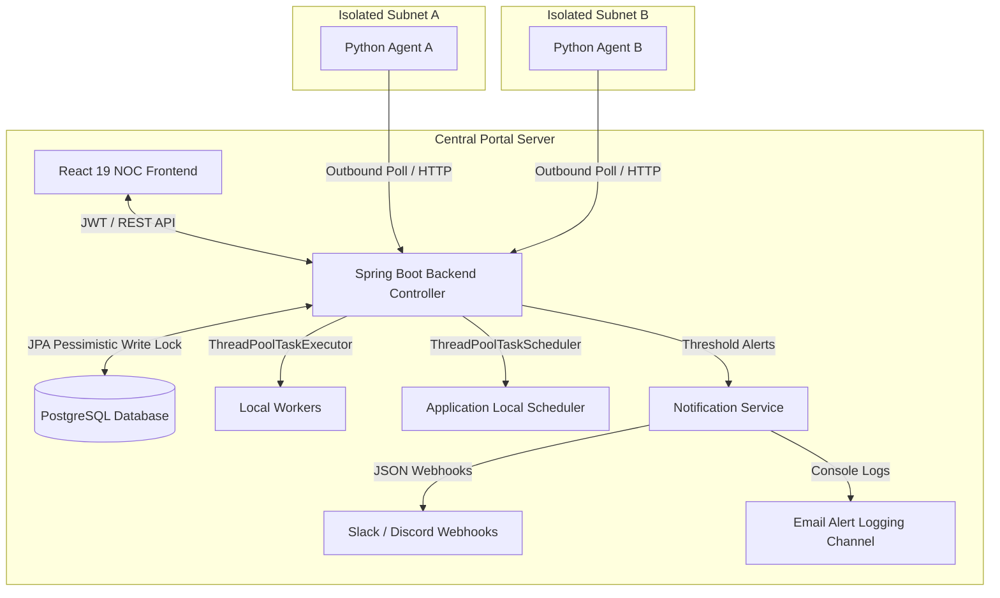

# 🌐 Distributed Network Monitoring & Diagnostic Portal

A production-grade, secure orchestration portal designed to coordinate distributed network diagnostics (Ping, iPerf3) across multiple remote subnets. Built with **Spring Boot 3 (Java 17)**, **React 19 (Vite 5)**, and **Python-based polling edge clients**, this platform measures latency, packet loss, and throughput from remote subnet vantage points back to target endpoints.

---

## 🚀 Technical Highlights

* **Distributed Edge Polling Architecture**: Remote agents run as lightweight Python processes within isolated subnets. Agents poll the central controller outbound using `X-Agent-Token` headers or HMAC-SHA256 request signing.
* **Atomic Job Claiming (Pessimistic Row Locking)**: Pending jobs are claimed using **JPA/Hibernate pessimistic row locking (`PESSIMISTIC_WRITE`)** on `TestJobRepository` to ensure thread-safe, single-worker job acquisition across concurrent polling agents.
* **Execution Lease Protection**: 
  * Every execution attempt receives a unique UUID (`executionLeaseId`).
  * Any retry or stale recovery reclaim generates a fresh, unique execution lease.
  * Result submission validates `jobId`, assigned `agentId`, `RUNNING` status, `attemptNumber`, and matching `executionLeaseId`.
  * Validation occurs under the authoritative pessimistic job lock (`PESSIMISTIC_WRITE`) to ensure stale workers cannot overwrite newer execution attempts.
* **Retry, Exponential Backoff & Stale Recovery**: Failed or timed-out job runs automatically requeue with configurable exponential backoff. Inactive running jobs exceeding stale thresholds are recovered and requeued up to `maxAttempts`.
* **Security & Injection Protection**:
  * **Authentication & RBAC**: JWT-based user authentication supporting `ADMIN`, `OPERATOR`, and `VIEWER` roles. Registration defaults to `VIEWER`.
  * **Hashed Agent Credentials**: Plaintext tokens are exposed once on creation/rotation; the backend stores only SHA-256 hashes (`tokenHash`).
  * **HMAC-SHA256 Request Signing**: Canonical payload (`{agentId}\n{METHOD}\n{PATH}\n{TIMESTAMP}\n{NONCE}\n{BODY}`) with 5-minute timestamp skew validation and process-local in-memory `NonceCache` replay protection.
  * **Command Allowlisting & Safe Execution**: Strict command allowlisting with direct `ProcessBuilder` list parameterization (no shell string evaluation).
  * **Target Host Validation**: `@HostOrIp` validator prevents injection and blocks loopback, metadata, link-local, and multicast address abuse.
* **Application-Local Cron Scheduler**: Automated execution schedules per profile managed via an application-local Spring `ThreadPoolTaskScheduler` instance (single-node scope).
* **Multi-Channel Alerting & Incidents**: Direct JSON HTTP webhook dispatch to **Slack** and **Discord** endpoints when metrics breach thresholds, paired with an incident lifecycle state machine (OPEN / ONGOING / RESOLVED) and console-logged email alerts (no external SMTP server required).
* **Test-Result Telemetry**: Packet loss, RTT, jitter, and throughput are strictly sourced from persisted test-result telemetry. The system never generates fake health fallbacks or synthetic metrics.
* **Security Audit Trails**: Administrative actions (agent creation, token rotation, job dispatches) are logged to a persistent `AuditLog` table.

---

## 📐 System Architecture



---

## 🛠️ Technology Stack

* **Backend**: Spring Boot 3.3, Java 17, Spring Security, JWT, JPA/Hibernate (`PESSIMISTIC_WRITE`), Spring Validation
* **Database & Schema Management**: PostgreSQL 15 managed via Hibernate automatic schema update (`spring.jpa.hibernate.ddl-auto: update`)
* **Frontend**: React 19 (`react` 19.x), Vite 5 (`vite` 5.x), Recharts 3, TailwindCSS 3, Lucide React
* **Edge Runners**: Python 3.10+, socket, subprocess, requests, hmac, hashlib

---

## ⚙️ Environment Setup & Dependencies

### Requirements
* **Java 17 JDK** or higher
* **Maven 3.8+**
* **Docker & Docker Compose**
* **Python 3.10+** (with `requests` library)
* **System Utilities**: `iperf3` and `iputils-ping` in system PATH for local worker execution.
  ```bash
  sudo apt update && sudo apt install iperf3 iputils-ping -y
  ```

---

## 🚀 Execution Guide

### Step 1: Start Database
```bash
docker compose up -d
```

### Step 2: Build & Run Spring Boot Backend
```bash
cd backend
mvn clean install
mvn spring-boot:run
```
*Backend server runs on port `8082` (or `8083` depending on configuration).*

### Step 3: Run React Frontend
```bash
cd frontend
npm install
npm run dev
```
*Frontend dev server runs on port `5173`.*

### Step 4: Connecting a Remote Python Subnet Agent
1. Register an agent via the Subnet Agents section in the UI (or via `POST /api/v1/agents` with `ADMIN` role) to obtain an agent token.
2. Launch the Python agent edge process:
   ```bash
   PORTAL_SERVER_URL="http://localhost:8082" AGENT_TOKEN="<PASTE_AGENT_TOKEN>" python3 python-agent/agent_client.py
   ```
3. To enable HMAC request signing:
   ```bash
   PORTAL_SERVER_URL="http://localhost:8082" AGENT_TOKEN="<PASTE_AGENT_TOKEN>" ENABLE_HMAC_SIGNING="true" python3 python-agent/agent_client.py
   ```

---

## 🛡️ Security Verification Examples

> **Note**: The credentials `default_admin` / `Admin123!` used below are **development/test credentials** initialized by `DataInitializer` for local testing.

### 1. Authenticate & Obtain JWT Token
```bash
curl -X POST http://localhost:8082/api/v1/auth/login \
  -H "Content-Type: application/json" \
  -d '{"username": "default_admin", "password": "Admin123!"}'
```

### 2. Dispatch a Diagnostic Test Job
```bash
curl -X POST http://localhost:8082/api/v1/jobs \
  -H "Authorization: Bearer <JWT_TOKEN>" \
  -H "Content-Type: application/json" \
  -d '{"profileId": 1, "agentId": 1}'
```

### 3. Agent Task Polling (Outbound HTTP)
```bash
curl -X GET http://localhost:8082/api/v1/agents/poll \
  -H "X-Agent-Token: <AGENT_TOKEN>"
```

### 4. Agent Result Submission (With Execution Lease Validation)
```bash
curl -X POST http://localhost:8082/api/v1/agents/results/<JOB_ID> \
  -H "X-Agent-Token: <AGENT_TOKEN>" \
  -H "Content-Type: application/json" \
  -d '{
    "executionLeaseId": "<LEASE_UUID_FROM_POLL>",
    "attemptNumber": 1,
    "status": "SUCCESS",
    "rttAvgMs": 14.2,
    "packetLossPct": 0.0,
    "rawOutput": "PING 8.8.8.8 56(84) bytes of data..."
  }'
```

